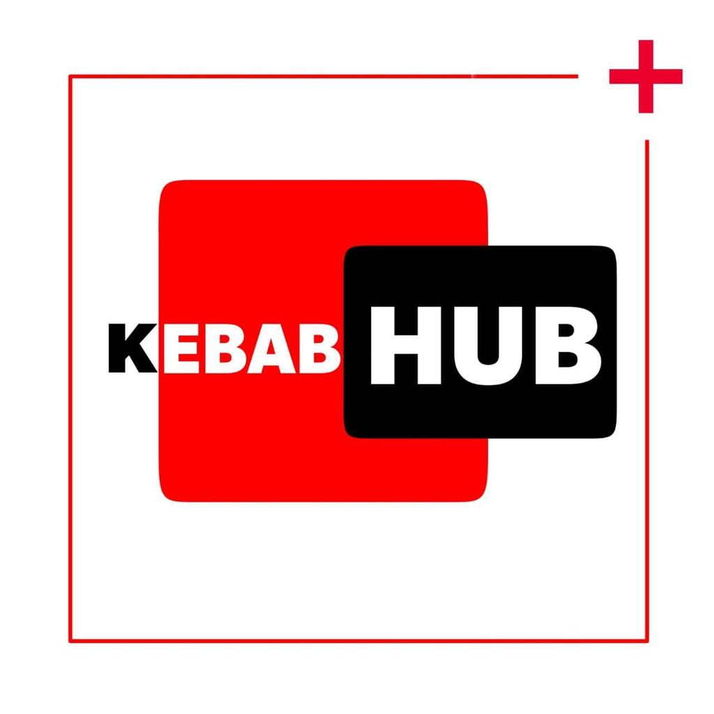

# Kebab(OnePlus_8T) hub

 

An app which helps kebab users to test various custom ROMs.
by the community for the community.
## Screenshots
|
---------------------------------------------------------------------|-----------------------------------------------------------------
|

## Features

1. The app uses onesignal api for app notifications from which i notify the users about the updates of ROMs as soon as they arrive.
2. It contains instrutions,download links of custom ROMs which are actively supported by the developers.
3. It also includes unbrick tool which helps in restoring the device to Oxygen Os from AOSP ROMs.
4. The App includes link to google camera community in telegram.
## Links
[**Playstore**](https://play.google.com/store/apps/details?id=com.shark.KebabHub)|[**Webapp**(If you are unable to access your phone)](https://kebabhubweb.web.app)
---------------------------------------------------------------------------------|----------------------------------------------

